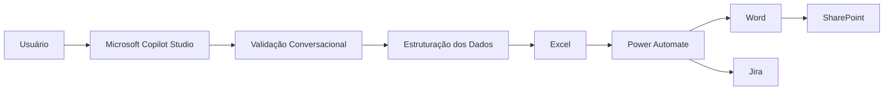

# 01 - Arquitetura da Solução

> **Documento anterior:** [README](../README.md)  
> **Próximo documento:** [02 - Decisões Arquiteturais](02-Decisoes-Arquiteturais.md)

---

# Arquitetura da Solução

## Objetivo

O Homologation AI Orchestrator foi concebido como uma arquitetura de apoio ao processo de homologação funcional.

Seu propósito não é substituir o conhecimento dos especialistas de negócio, mas atuar como uma camada de organização, padronização e automação, reduzindo atividades operacionais repetitivas e aumentando a qualidade dos registros produzidos durante a execução dos testes.

A solução utiliza Inteligência Artificial Conversacional para transformar informações fornecidas em linguagem natural em registros estruturados, que posteriormente são utilizados pelos processos automatizados.

---

# Visão Geral

A arquitetura foi construída seguindo o princípio de **separação de responsabilidades**, onde cada componente possui uma função específica dentro da solução.

Cada tecnologia foi selecionada para executar apenas as responsabilidades em que apresenta maior eficiência, reduzindo o acoplamento entre componentes e facilitando futuras manutenções.

---

# Componentes da Arquitetura

## Microsoft Copilot Studio

O Microsoft Copilot Studio representa a camada conversacional da solução.

Sua principal responsabilidade consiste em receber informações fornecidas pelos usuários, interpretar o contexto da conversa, identificar informações ausentes e organizar os dados conforme o padrão esperado pelo processo de homologação.

O agente atua como facilitador da documentação, mantendo o usuário como responsável pelas decisões relacionadas às regras de negócio.

### Responsabilidades

- Interpretar linguagem natural.
- Validar informações obrigatórias.
- Solicitar complementação quando necessário.
- Estruturar os dados para o modelo operacional.
- Disponibilizar informações para as automações posteriores.

---

## Microsoft Excel

O Excel atua como repositório operacional da solução.

Todos os registros produzidos pelo agente são armazenados em uma estrutura padronizada, utilizada como fonte de dados para consultas, indicadores e automações.

A utilização do Excel também permite que usuários de negócio continuem trabalhando em um ambiente já conhecido, reduzindo a necessidade de adaptação do processo existente.

### Responsabilidades

- Armazenamento estruturado dos testes.
- Histórico das homologações.
- Fonte de dados para consultas.
- Base para geração de indicadores.
- Fonte para os fluxos automatizados.

---

## Power Automate

O Power Automate é responsável pela camada de orquestração.

Após a inclusão de novos registros no repositório operacional, diferentes fluxos são executados automaticamente para dar continuidade ao processo de homologação.

Essa separação permite que a inteligência permaneça concentrada no agente conversacional enquanto toda a integração entre sistemas seja realizada pela plataforma de automação.

### Responsabilidades

- Orquestração dos processos.
- Execução de automações.
- Integração entre aplicações.
- Geração automática de documentos.
- Atualização de sistemas relacionados.

---

## Microsoft Word

Os documentos Word representam as evidências formais produzidas durante o processo de homologação.

Sua geração ocorre de forma automatizada utilizando modelos previamente definidos, reduzindo retrabalho e garantindo maior padronização entre diferentes usuários.

### Responsabilidades

- Geração de evidências.
- Padronização documental.
- Registro formal das homologações.

---

## SharePoint

O SharePoint atua como repositório documental da arquitetura.

Todos os documentos gerados automaticamente são armazenados em um único ambiente, facilitando consultas futuras, organização dos arquivos e compartilhamento entre equipes.

### Responsabilidades

- Armazenamento dos documentos.
- Organização das evidências.
- Centralização dos arquivos.
- Disponibilização para consulta.

---

## Jira

O Jira representa a camada de gerenciamento de incidentes.

Sempre que necessário, as informações estruturadas durante o processo de homologação podem ser utilizadas para apoiar o registro dos incidentes identificados durante os testes.

A classificação final permanece sob responsabilidade do usuário, preservando a análise humana em situações que exigem conhecimento do contexto do negócio.

### Responsabilidades

- Registro de incidentes.
- Acompanhamento das correções.
- Gestão das demandas.
- Rastreabilidade dos problemas identificados.

---

# Arquitetura em Camadas

A arquitetura pode ser compreendida em cinco camadas principais.

| Camada | Responsabilidade |
|---------|------------------|
| Conversacional | Interação entre usuário e agente |
| Validação | Organização e consistência das informações |
| Operacional | Armazenamento estruturado dos registros |
| Automação | Execução dos processos automatizados |
| Documentação e Gestão | Evidências, documentos e incidentes |

Essa separação reduz o acoplamento entre componentes e facilita a evolução da solução sem impactar todo o fluxo operacional.

---

# Princípios Arquiteturais

Durante o desenvolvimento da solução foram adotados alguns princípios para orientar sua construção.

## Separação de responsabilidades

Cada tecnologia executa apenas a função para a qual foi designada.

O agente interpreta informações.

O Excel armazena dados.

O Power Automate executa integrações.

O Word gera documentos.

O SharePoint organiza arquivos.

O Jira gerencia incidentes.

---

## Aproveitamento do ambiente existente

Sempre que possível, a arquitetura utiliza ferramentas já presentes no ambiente Microsoft 365, reduzindo a necessidade de adoção de novas plataformas e simplificando a utilização pelos usuários.

---

## Padronização

Independentemente do usuário responsável pela homologação, todas as informações seguem a mesma estrutura de documentação, facilitando consultas, auditorias e integração com os demais componentes.

---

## Escalabilidade

Novos fluxos automatizados podem ser adicionados futuramente sem necessidade de alterar o comportamento do agente conversacional, preservando a independência entre as camadas da arquitetura.

---

# Considerações Finais

A arquitetura do Homologation AI Orchestrator foi projetada para organizar o processo de homologação através da integração entre Inteligência Artificial Conversacional, automação e ferramentas colaborativas.

Ao distribuir responsabilidades entre componentes especializados, a solução reduz atividades repetitivas, aumenta a padronização das informações e fortalece a rastreabilidade dos processos, preservando o papel dos especialistas de negócio na tomada de decisão.

---

➡️ **Próximo documento:** [02 - Decisões Arquiteturais](02-Decisoes-Arquiteturais.md)
