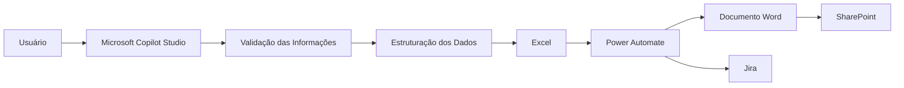
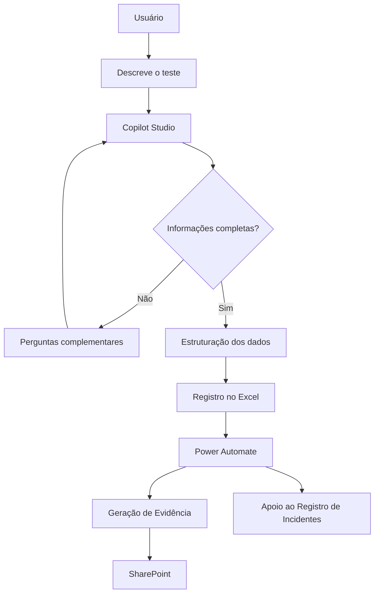

# 03 - Fluxo Operacional

> **Documento anterior:** [02 - Decisões Arquiteturais](02-Decisoes-Arquiteturais.md)  
> **Próximo documento:** [04 - Roadmap](04-Roadmap.md)

---

# Fluxo Operacional

## Objetivo

Este documento apresenta o funcionamento da arquitetura durante um processo de homologação funcional.

O fluxo foi projetado para reduzir atividades repetitivas, padronizar registros e automatizar etapas posteriores do processo, mantendo o usuário responsável pelas decisões relacionadas às regras de negócio.

---

# Visão Geral

A arquitetura segue um fluxo sequencial onde cada componente executa apenas sua responsabilidade específica.

---

# Etapa 1 — Início da Homologação

O processo começa quando o usuário inicia uma conversa com o agente.

Durante essa interação, o usuário descreve o cenário executado utilizando linguagem natural, sem necessidade de seguir uma estrutura previamente definida.

Exemplo:

> "Realizei o teste de cadastro de fornecedor. O cadastro foi salvo normalmente, porém a integração com o financeiro não ocorreu."

Nesse momento nenhuma informação é registrada.

O objetivo do agente é compreender o contexto informado.

---

# Etapa 2 — Validação das Informações

Após interpretar a solicitação, o agente verifica se todas as informações necessárias para o registro da homologação foram fornecidas.

Quando identifica informações ausentes ou insuficientes, conduz a conversa realizando perguntas complementares.

Essa etapa busca garantir que o registro final seja consistente e contenha todas as informações esperadas pelo processo.

Exemplos de validação:

- Cenário executado.
- Resultado esperado.
- Resultado obtido.
- Evidências disponíveis.
- Observações adicionais.

O agente somente prossegue quando as informações necessárias estiverem completas.

---

# Etapa 3 — Estruturação dos Dados

Após a validação, as informações fornecidas pelo usuário são organizadas em um formato padronizado.

Nesse momento a conversa em linguagem natural é convertida em um registro estruturado compatível com o modelo utilizado durante o processo de homologação.

O objetivo dessa etapa é reduzir diferenças na forma como cada usuário documenta seus testes.

---

# Etapa 4 — Registro Operacional

Os dados estruturados são registrados no repositório operacional.

Esse registro torna-se a fonte oficial das informações relacionadas ao processo de homologação.

Além de centralizar os dados, essa etapa permite que todas as automações utilizem uma única origem de informação.

---

# Etapa 5 — Execução das Automações

Após a atualização do repositório operacional, o Power Automate identifica novos registros e executa os fluxos configurados.

Esses fluxos são responsáveis por automatizar atividades que anteriormente eram realizadas manualmente.

Entre elas:

- geração de documentos;
- armazenamento de evidências;
- atualização de sistemas;
- apoio ao gerenciamento de incidentes.

O agente não participa dessas atividades.

Sua responsabilidade encerra-se após a estruturação das informações.

---

# Etapa 6 — Geração de Evidências

Os dados registrados são utilizados para preencher automaticamente modelos de documentação.

O objetivo dessa etapa é reduzir o tempo gasto na elaboração das evidências e garantir que todos os documentos sigam um padrão único.

Os documentos produzidos passam a representar o registro formal da homologação executada.

---

# Etapa 7 — Organização dos Documentos

Após sua geração, os documentos são armazenados automaticamente em um repositório centralizado.

Essa organização facilita consultas futuras, compartilhamento entre equipes e rastreabilidade das homologações realizadas.

---

# Etapa 8 — Gestão de Incidentes

Quando o processo de homologação identifica um comportamento diferente do esperado, as informações estruturadas podem ser utilizadas para apoiar o registro de um incidente.

A arquitetura prepara os dados necessários para o processo.

Entretanto, informações que dependem de análise de contexto permanecem sob responsabilidade do usuário.

Essa abordagem preserva a participação humana durante decisões relacionadas ao negócio.

---

# Fluxo Consolidado

---

# Responsabilidade dos Componentes

| Etapa | Componente | Responsabilidade |
|--------|------------|------------------|
| Conversa | Copilot Studio | Interpretar a solicitação do usuário |
| Validação | Copilot Studio | Identificar informações ausentes |
| Estruturação | Copilot Studio | Organizar os dados |
| Registro | Excel | Armazenar informações estruturadas |
| Automação | Power Automate | Executar os fluxos automatizados |
| Evidências | Word | Gerar documentação padronizada |
| Documentação | SharePoint | Armazenar documentos |
| Incidentes | Jira | Apoiar o gerenciamento dos problemas encontrados |

---

# Exemplo Simplificado

O exemplo abaixo representa uma interação simplificada durante uma homologação.

**Usuário**

> Executei o teste de cadastro de fornecedor.

**Agente**

> Qual era o comportamento esperado?

**Usuário**

> O cadastro deveria ser concluído com sucesso.

**Agente**

> Qual foi o comportamento observado?

**Usuário**

> O cadastro foi salvo, porém a integração com o módulo financeiro não ocorreu.

**Agente**

> Existe alguma evidência disponível para anexar?

**Usuário**

> Sim, realizei capturas de tela durante o teste.

Após a validação dessas informações, o agente estrutura automaticamente o conteúdo para o modelo de homologação utilizado pela solução.

---

# Benefícios do Fluxo

A arquitetura proposta proporciona melhorias importantes ao processo de homologação.

- Redução do retrabalho operacional.
- Padronização dos registros.
- Maior consistência documental.
- Melhor rastreabilidade das homologações.
- Organização centralizada das evidências.
- Integração entre documentação e automações.
- Separação clara entre interação, armazenamento e automação.

---

# Considerações Finais

O fluxo operacional foi estruturado para manter a experiência do usuário simples e orientada por conversação, enquanto as atividades repetitivas relacionadas à documentação e organização das informações são executadas automaticamente.

Essa abordagem permite que os especialistas de negócio concentrem seus esforços na validação do sistema, enquanto a arquitetura atua como suporte para padronização e continuidade do processo.

---

⬅️ **Documento anterior:** [02 - Decisões Arquiteturais](02-Decisoes-Arquiteturais.md)

➡️ **Próximo documento:** [04 - Roadmap](04-Roadmap.md)