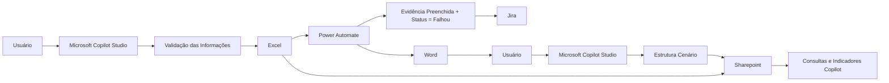

<p align="center">

# Homologation Orchestrator AI

### Arquitetura de IA para Padronização de Homologações Funcionais e Automação de Processos

Uma solução construída com Microsoft Copilot Studio e Power Platform para estruturar registros de homologação, automatizar evidências e integrar processos de QA.

---

# 📖 Sobre o Projeto

O **Homologation Orchestrator AI** é uma arquitetura de IA desenvolvida para apoiar processos de homologação funcional.

Ao invés de substituir o conhecimento dos especialistas de negócio, a solução utiliza Inteligência Artificial Conversacional para transformar descrições em linguagem natural em registros estruturados, padronizados e prontos para integração com o restante do fluxo operacional.

A arquitetura combina Microsoft Copilot Studio, Power Automate e Microsoft 365 para reduzir atividades repetitivas, aumentar a qualidade da documentação e fortalecer a rastreabilidade entre testes, evidências e incidentes.

---
# 🛠️ Tecnologias

<p align="center">


</p>

---

# 🚀 Principais Funcionalidades

- 🤖 Interpretação de informações em linguagem natural
- 📋 Padronização de registros de homologação
- ❓ Identificação de informações ausentes através de perguntas complementares
- 📄 Apoio na construção de evidências de testes
- ⚙️ Geração automática de documentos
- 📊 Consultas operacionais e gerenciais
- 🔄 Integração com processos automatizados
- 🗂 Organização centralizada das informações

---

# 🏗 Arquitetura

A solução foi construída seguindo o princípio de **separação de responsabilidades**, onde cada componente possui uma função específica dentro do processo.



---

# 🛠 Tecnologias Utilizadas

| Tecnologia | Finalidade |
|------------|------------|
| Microsoft Copilot Studio | IA Conversacional |
| Power Automate | Automação e integração |
| Microsoft Excel | Repositório operacional |
| Microsoft Word | Geração de evidências |
| SharePoint | Repositório documental |
| Jira | Gestão de incidentes |

---

# 📂 Estrutura do Projeto

```text
Homologation-Orchestrator-AI
│
├── README.md
│
├── docs/
│   ├── 01-Arquitetura.md
│   ├── 02-Decisoes-Arquiteturais.md
│   ├── 03-Fluxo-Operacional.md
│   └── 04-Roadmap.md
│
├── examples/
│   ├── sample_homologation.xlsx
│   ├── sample_evidence.docx
│   ├── sample_incident.md
│   └── conversation.md
│
├── images/
│
└── LICENSE
```

---

# 📚 Documentação

A documentação completa encontra-se na pasta **docs**.

| Documento | Descrição |
|-----------|-----------|
| 📘 Arquitetura | Visão completa da arquitetura da solução |
| ⚖️ Decisões Arquiteturais | Justificativas técnicas e trade-offs adotados durante o projeto |
| 🔄 Fluxo Operacional | Funcionamento completo da solução do início ao fim |
| 🚀 Roadmap | Possíveis evoluções futuras da arquitetura |

---

# 💡 Objetivos do Projeto

Este projeto foi desenvolvido com os seguintes objetivos:

- Demonstrar a utilização de IA Conversacional em processos corporativos.
- Explorar arquiteturas utilizando Microsoft Copilot Studio e Power Platform.
- Estruturar um fluxo de homologação mais padronizado e rastreável.
- Reduzir atividades operacionais repetitivas através de automações.
- Demonstrar decisões arquiteturais orientadas ao contexto do negócio.

---

# 📌 Observações

O foco deste projeto não está na substituição dos usuários responsáveis pela homologação.

A IA atua como uma camada de apoio operacional, auxiliando na organização das informações e na padronização dos registros, enquanto as decisões relacionadas ao processo permanecem sob responsabilidade dos especialistas de negócio.

---

## 📄 Licença e Uso

Este projeto possui finalidade exclusivamente educacional e de demonstração técnica.

Este repositório é disponibilizado exclusivamente como portfólio técnico.

Seu objetivo é apresentar a arquitetura, as decisões de projeto e a abordagem utilizada para resolver um problema de automação de processos utilizando Microsoft Power Platform.

Não é um projeto open source.
